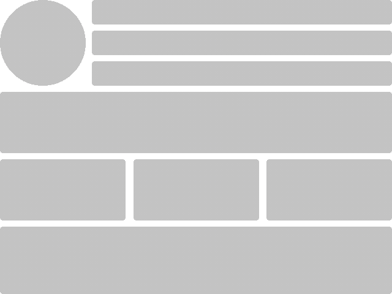

# Skeleton
<p align="center">
    
</p>

Skeleton is a simple way to create content placeholder screen view.

## How to install
```
npm i @lexxcode/skeleton
```
## How to use
To create your own skeleton you can apply a basic mixin `skeleton`. Feel free to use custom CSS properties, any units, and calc function to implement a screen view placeholder.
```scss
.block {
    --color: #c3c3c3;

    width: 300px;

    &:empty {
        &::before {
            content: '';
            height: 400px;
            display: block;

            @include skeleton(
                skeleton-ellipse($color: var(--color), $width: 40px, $height: 40px, $x: left, $y: top),
                skeleton-rect($color: var(--color), $width: calc(100% - 50px), $height: 10px, $x: 50px, $y: 0, $radius: 5px),
                skeleton-rect($color: var(--color), $width: calc(100% - 50px), $height: 10px, $x: 50px, $y: 15px, $radius: 5px),
                skeleton-rect($color: var(--color), $width: calc(100% - 50px), $height: 10px, $x: 50px, $y: 30px, $radius: 5px)
            );
        }
    }
}
```


### skeleton-ellipse
The function is designed to create circles and ellipses.

#### Options:
- **`$color`** - `<Color>` Color of ellipse
- **`$width`** - `<Length | Percentage | calc()>` Width of ellipse
- **`$height`** - `<Length | Percentage | calc()>` Height of ellipse
- **`$x`** - `<Length | Percentage | calc() | left | center | right>` Horizontal position of shape, same as `background-position-x`. Default value is `0`
- **`$y`** - `<Length | Percentage | calc() | top | center | bottom>` Vertical position of shape, same as `background-position-y`. Default value is `0`
- **`$clip`** - `<border-box | padding-box | content-box>` same as `background-clip`. Default value `<border-box>`

### skeleton-rect
The function is designed to create rectangle shape with the ability to set rounding of corners.

#### Options:
- **`$color`** - `<Color>` Color of ellipse
- **`$width`** - `<Length | Percentage | calc()>` Width of ellipse
- **`$height`** - `<Length | Percentage | calc()>` Height of ellipse
- **`$x`** - `<Length | Percentage | calc() | left | center | right>` Horizontal position of shape, same as `background-position-x`. Default value is `0`
- **`$y`** - `<Length | Percentage | calc() | top | center | bottom>` Vertical position of shape, same as `background-position-y`. Default value is `0`
- **`$radius`** - `<Length | null>` - The property rounds the corners
- **`$clip`** - `<border-box | padding-box | content-box>` same as `background-clip`. Default value `<border-box>`
